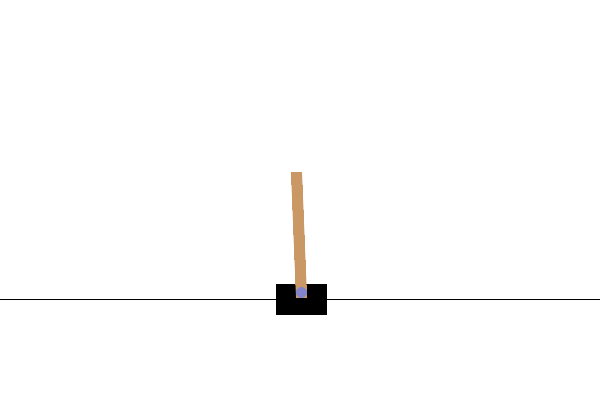
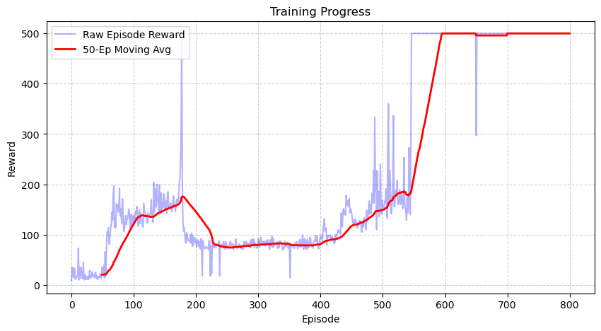

# 🧠 Deep Q-Network (DQN) Implementation

This directory contains a highly modular, readable, and reproducible PyTorch implementation of the **Deep Q-Network (DQN)** algorithm. It is evaluated on the classic reinforcement learning benchmark `CartPole-v1`.

---

## 📖 Algorithm Overview

DQN is a model-free, off-policy, value-based reinforcement learning algorithm designed for discrete action spaces. It combines reinforcement learning with deep neural networks to approximate the optimal action-value function:

$$Q^*(s, a) = \max_{\pi} \mathbb{E} \left[ \sum_{t=0}^{\infty} \gamma^t R_t \;\middle|\; S_0 = s, A_0 = a \right]$$

### ⚡ Key Algorithmic Features in This Implementation

1. **Replay Buffer (`utils/buffers.py`):** 
   Breaks temporal correlations in consecutive agent transitions. By storing experiences $(s, a, r, s', d)$ and sampling uniformly random batches during optimization, we satisfy the i.i.d. assumption necessary for gradient descent.

2. **Polyak Soft Target Updates ($\tau$):**
   Instead of copying the policy network weights to the target network periodically, we perform a smooth update on every training step:
   $$\theta_{\text{target}} \leftarrow \tau \theta_{\text{policy}} + (1 - \tau) \theta_{\text{target}}$$
   where $\tau = 0.005$. This provides extremely stable target values $Y_t$ and prevents Q-value estimation oscillations.

3. **Huber Loss (Smooth L1 Loss):**
   Robust regression loss function that behaves quadratically for small errors and linearly for large errors. This prevents gradient explosion caused by large TD-errors early in training:
   $$L_\delta(a) = \begin{cases} \frac{1}{2}a^2 & \text{for } |a| \le \delta, \\ \delta(|a| - \frac{1}{2}\delta) & \text{otherwise.} \end{cases}$$

4. **AMSGrad AdamW Optimizer:**
   Uses modern weight decay parameters alongside the `AMSGrad` variant of Adam to ensure bounded learning rates and steady weight convergence.

5. **Exponential Epsilon-Greedy Decay:**
   Encourages broad exploration during the initial steps, systematically decaying to exploitation as training steps scale:
   $$\epsilon = \epsilon_{\text{min}} + (\epsilon_{\text{max}} - \epsilon_{\text{min}}) \cdot e^{-\frac{\text{steps}}{\text{decay\_rate}}}$$

---

## 📁 Module Structure

* [agent.py](agent.py): The `DQNAgent` orchestrator containing:
  - Action selection under epsilon-greedy scheduling.
  - The optimization step using Huber loss and target network updates.
* [model.py](model.py): A custom multi-layer perceptron (MLP) neural network architecture with configurable hidden layers.
* [DQN_Cartpole.ipynb](DQN_Cartpole.ipynb): A complete, self-contained playground notebook.

---

## 📓 Google Colab & Jupyter Playground

This implementation includes a fully interactive Jupyter notebook: **[DQN_Cartpole.ipynb](DQN_Cartpole.ipynb)**. 

It is designed to run seamlessly in **Google Colab** or a local Jupyter server, allowing you to:
* **Instant Environment Provisioning:** Install the required `gymnasium` and rendering packages directly within the cloud environment.
* **Interactive Walkthrough:** Train the agent step-by-step and inspect intermediate outputs.
* **Inline Video Rendering:** Watch the trained agent balance the CartPole directly inside your browser window without setting up local X11 display forwarding.

To run in Google Colab:
1. Upload [DQN_Cartpole.ipynb](DQN_Cartpole.ipynb) to your Google Drive or open it directly from a GitHub repository link in Colab.
2. Select a GPU runtime (optional but recommended for faster training).
3. Execute all cells to watch the DQN agent learn in real time!

---

## 📈 Results & Visualizations (CartPole-v1)

The DQN agent was trained on `CartPole-v1` for 1200 episodes using the parameters in [DQN_cartpole.yaml](../../configs/DQN_cartpole.yaml).

### 🎮 Trained DQN Agent in Action
Below is a demonstration of the fully optimized policy network keeping the pole upright indefinitely:



### 📊 Convergence Curve
The training learning curve shows stable convergence to the maximum possible reward ($500.0$) within $\sim 600$ episodes:



---

## ⚙️ Hyperparameters

Our configurations are modular and managed through [configs/DQN_cartpole.yaml](../../configs/DQN_cartpole.yaml):

```yaml
env:
  name: 'CartPole-v1'
  max_steps: 500

network:
  hidden_size: 128

hyperparameters:
  lr: 3.0e-4
  gamma: 0.99
  tau: 0.005
  buffer_capacity: 10000
  batch_size: 128

exploration:
  max_epsilon: 0.9
  min_epsilon: 0.01
  decay_rate: 2000
```

---

## 🚀 How to Run

1. **Train the DQN Agent:**
   ```bash
   python train.py --config configs/DQN_cartpole.yaml
   ```
2. **Evaluate and Render GIF:**
   ```bash
   python eval.py
   ```
